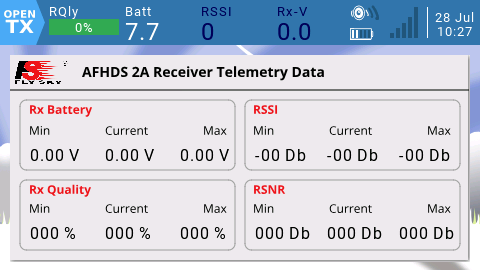
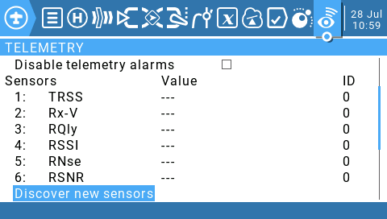

# FlySkyRx
Fly Sky standard telemetry LUA widget for OpenTx color radios  

The widjet works with Fly Sky FS-iA6B and FS-iA10B and show Min, Max and Current values of this parameters:

1. Rx Battery 
2. RSSI - Receiver Signal Streight Indicator
3. Rx Quality - Receiver Signal Quality
4. RSNR - Receiver Signal to Noise Ratio

Requirements
------------
An OpenTx Radio with color display such Radiomaster Tx16s.

Install
-------
Download and copy into your SD/WIDGETS directory.  
On the radio telemetry page, add a page with single zone and select the widget FlySkyRx.

Configure
---------

Simply check on model telemetry page if sensors names are as shown in the picture, otherwise simple edit names to match values in the picture.

Rx battery sensor name: Rx-V

RSSI sensor name: RSSI

RSNR sensor name: RSNR

Rx Quality sensor name: RQly

Names are case sensitive!
